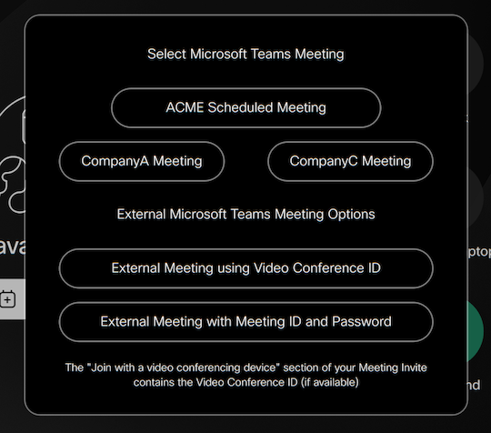

# wi-teams-button

Designed for customers who have an existing CVI Subscription.

Adds a Microsoft Teams button on the UI allowing you to join both CVI and WebRTC Meetings.

You can also optionally define up to 6 external cvi providers for a simplified join experience

This has been refactored from a per-device macro to instead run from a central location, ideally as a docker container, and leverages the Webex cloud xAPIs to manage and subscribe to events for your devices.



## Prerequisites

1. Navigate to Workspace Integrations in [Control Hub](https://admin.webex.com/workspaces/integrations)
2. Select `Add integration` then `Upload integration` and provide included manifest.json file - ensure you document the provided credentials
3. Navigate to the newly created Integration and select `Activate` from the `Actions` menu - ensure you document the encoded activation code
3. Add the required Device Tag (default: `wi-room-release`) to each device to be managed by this integration

## Deployment (Local)

1. Clone / Download repository
2. Run `npm install` to add the require dependencies (ensure Node and NPM are installed)
3. Create an `.env` file and include the required variables outlined below.
- Recommend adding `WI_LOGGING=info`, `CONSOLE_LEVEL=debug` and `LOG_DETAILED=true` during initial testing
4. Start the integration using `npm run start`
5. Review the console logs to confirm no errors encountered

## Deployment (Docker)

1. Build and Deploy Docker Container (or deploy to Cloud) - ensure you include the required variables outlined below.
- This integration does not require local device access as all communications are done over Cloud xAPI.

    ```
    > docker build --tag wi-teams-button .
    > docker create --name wi-teams-button \
      -e _ENVIRONMENTAL_VARIABLE_ = _value_ \
      wi-teams-button
    ```

2. Review the logs from the Integration output to confirm no errors encountered


### Environmental Variables

These variables can be individually defined in Docker, or loaded as an `.env` file in the app directory.

| Name | Required | Type | Default | Description
| ---- | ---- | ---- | ------- | -----------
| **Integration Settings**
| CLIENT_ID | **Yes** | string | ` ` | Client Identifier provided during the Integration creation process
| CLIENT_SECRET | **Yes** | string | ` ` | Client Secret provided during the Integration creation process
| **---**
| CODE | no* | string | ` ` | Encoded Activation Code provided during the Integration activation process
| *-- or --*
| OAUTH_URL | no* | string | ` ` | Decoded oAuth URL from the Activation Code
| REFRESH_TOKEN | no* | string | ` ` | Decoded Refresh Token from the Activation Code
| WEBEXAPIS_BASE_URL | no* | string | ` ` | Decoded Webex APIs Base Url from the Activation Code
| APP_URL | no* | ` ` | string | Decoded App Url from the Activation Code
| **---**
| DEVICE_TAG | no | string | `wi-room-release` | Device Tag used to determine which devices to process
| **Logging Settings**
| LOG_DETAILED | no | bool | `true` | Enable detailed logging
| CONSOLE_LEVEL | no | bool | `info` | Logging level exposed to console
| APP_NAME | no | string | `wi-room-release` | App Name used for logging service
| SYSLOG_ENABLED | no | bool | `false` | Enable external syslog server
| SYSLOG_HOST | no | string | `syslog` | Destination host for syslog server
| SYSLOG_PORT | no | num | `514` | Destination port for syslog server
| SYSLOG_PROTOCOL | no | str | `udp4` | Destination protocol for syslog server
| SYSLOG_SOURCE | no | str | `localhost` | Host to indicate that log messages are coming from
| LOKI_ENABLED | no | bool | `false` | Enable external Loki logging server
| LOKI_HOST| no | string | `http://loki:3100` | Destination host for Loki logging server
| **HTTP Proxy**
| GLOBAL_AGENT_HTTP_PROXY | no | string | ` ` | Container HTTP Proxy Server (format `http://<ip or fqdn>:<port>`)
| GLOBAL_AGENT_NO_PROXY | no | string | ` ` | Comma Separated List of excluded proxy domains (Supports wildcards)
| **Teams Button**
| TB_CUSTOMER_TENANT | **yes** | bool | ` ` | Customer CVI tenant
| TB_CUSTOMER_TEXT | no | string | `Internal Meeting` | Text shown for Internal meeting option
| TB_BUTTON_TEXT | no | string | `Microsoft Teams` | Text to display on button
| TB_PANEL_ID | no | string | `60` | Panel identifier
| TB_PANEL_TITLE | no | string | `Select Microsoft Teams Meeting` | Title text for Panel
| TB_EXTERNAL_CVI | no | bool | `true` | Disable to not include external cvi option
| TB_PROMPT_TIMEOUT | no | num | `90` | Seconds before prompts are closed
| TB_DEFAULT_TENANT | no | string | `@m.webex.com` | Default tenant for external cvi requests
| TB_HIDE_BUTTON | no | bool | `true` | Hide default teams button from ui
| TB_REBUILD_UI | no | bool | `false` | Enable to rebuild panel and button on Integration restart
| TB_DEFINED_TENANTS | no | json | ` ` |  6 defined buttons for common external CVI providers (see below)
| LOG_UNKNOWN_RESPONSES | no | bool | `false` | Show unknown extension responses in the log (useful in debugging issues)

***Note:** You must either include the encoded Activation Code, or the four individual decoded parameters.

### Defined Tenants

You can optionally include up to 6 pre-defined external CVI providers on this panel allowing your customers easier ability to dial meetings hosted by these providers. 

You need to structure the ENV Parameter as follows (ensure you use a different identifier per entry) 
```
[
  { "id": "btnTenant1", "text": "CompanyA Meeting", "tenant": "company1@m.webex.com" },
  { "id": "btnTenant2", "text": "CompanyC Meeting", "tenant": "teams@company2.onpexip.com" },
]
```

then **remove** the line breaks and **remove** the comma from the last entry, for example:

`TB_DEFINED_TENANTS=[{ "id": "btnTenant1", "text": "CompanyA Meeting", "tenant": "company1@m.webex.com" },{ "id": "btnTenant2", "text": "CompanyC Meeting", "tenant": "teams@company2.onpexip.com" }]`

If your JSON is still not accepted during Integration startup (i.e. it throws an Invalid error), please use a JSON Linter, such as [JSONLint](https://jsonlint.com/) to validate your entries.

## Support

In case you've found a bug, please [open an issue on GitHub](../../issues).

## Disclaimer

This script is NOT guaranteed to be bug free and production quality.
